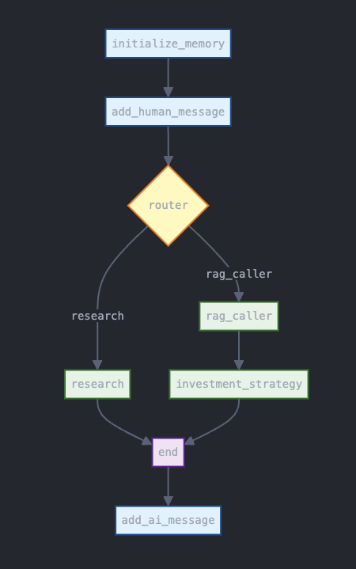

# Stock Market Assistant

A powerful AI-powered assistant for stock market analysis, investment strategies, and financial advice.

## Overview

The Stock Market Assistant is a Streamlit-based web application that leverages OpenAI's language models to provide expert financial advice through specialized agents:

- **Investment Strategy Agent**: Provides personalized advice on asset allocation, portfolio rebalancing, trading strategies, and long-term financial planning.
- **Market Research Agent**: Delivers real-time market research, stock analysis, news analysis, market trends, and insights on company performance.

## Agent Architecture

The application uses a multi-agent architecture to process user queries and generate comprehensive responses:



The workflow consists of the following steps:

1. **Initialize Memory**: Sets up the conversation memory for the session
2. **Add Human Message**: Processes the user's input query
3. **Router**: Determines which specialized agent should handle the query
4. **Specialized Agents**:
   - **Research Agent**: Conducts market research and stock analysis
   - **RAG Caller**: Retrieves relevant information from the knowledge base
   - **Investment Strategy**: Develops personalized investment recommendations
5. **End**: Consolidates information from the specialized agents
6. **Add AI Message**: Delivers the final response to the user

This architecture ensures that each query is handled by the most appropriate agent, providing accurate and relevant information to the user.

## Features

- Interactive chat interface for natural language queries
- Real-time stock market data through SerpAPI integration
- Knowledge base with investment strategies and financial concepts
- Personalized investment advice based on user preferences
- Persistent conversation history during sessions

## Requirements

- Python 3.8+
- OpenAI API key
- SerpAPI key (for market research)
- PostgreSQL database (for knowledge base)

## Installation

1. Clone the repository:
   ```
   git clone <repository-url>
   cd stock-market-assistant
   ```

2. Install the required dependencies:
   ```
   pip install -r requirements.txt
   ```

3. Create a `.env` file in the root directory with the following variables:
   ```
   OPENAI_API_KEY=your_openai_api_key
   PG_CONNECTION_STRING=your_postgresql_connection_string
   SERP_API_KEY=your_serpapi_key
   ```

## Database Setup

The application uses PostgreSQL with the pgvector extension for storing and retrieving knowledge base information:

1. Make sure you have PostgreSQL installed and running
2. Create a database for the application
3. Install the pgvector extension in your database
4. Update the `PG_CONNECTION_STRING` in your `.env` file

To populate the knowledge base with initial data:

```
cd text_data
python main.py
```

This script will process the "Market Wizards" book and store it in the database as vector embeddings.

## Running the Application

Start the Streamlit application:

```
streamlit run app.py
```

The application will be available at http://localhost:8501 by default.

## Usage

1. Enter your OpenAI API key in the sidebar
2. Start asking questions about stocks, investment strategies, or market research
3. The assistant will route your query to the appropriate specialized agent
4. View the response and continue the conversation

Example questions:
- "What investment strategy would you recommend for a beginner?"
- "How should I allocate my portfolio between stocks and bonds?"
- "Can you analyze the performance of Tesla stock over the past year?"
- "What are the latest market trends in the tech sector?"
- "Explain the concept of dollar-cost averaging"

## Local Development

If you want to run the application locally without setting up a PostgreSQL database, you'll need to:

1. Install PostgreSQL locally
2. Create a database and install the pgvector extension
3. Update the `PG_CONNECTION_STRING` in your `.env` file to point to your local database
4. Run the text_data/main.py script to populate the database

## API Keys

This application requires the following API keys:

1. **OpenAI API Key**: Required for the language models. You can obtain one from [OpenAI's platform](https://platform.openai.com/).
2. **SerpAPI Key**: Required for real-time market data. You can get one from [SerpAPI](https://serpapi.com/).

## Notes

- The application uses the OpenAI GPT-4o model by default
- Conversation history is maintained during the session but not persisted between sessions
- You can clear the chat history using the button in the sidebar 